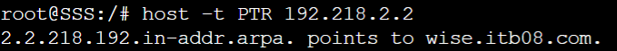
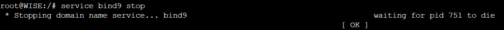
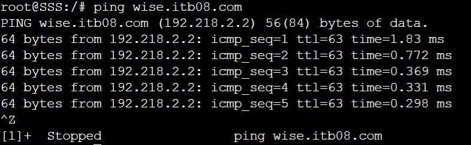
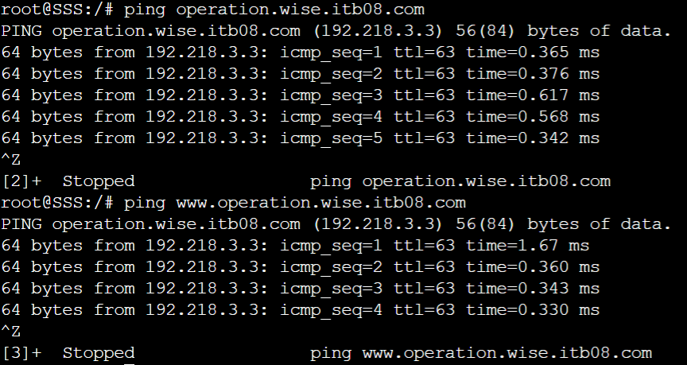
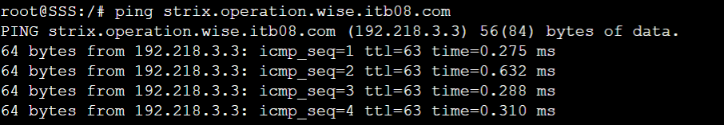
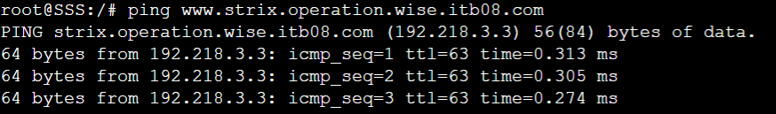
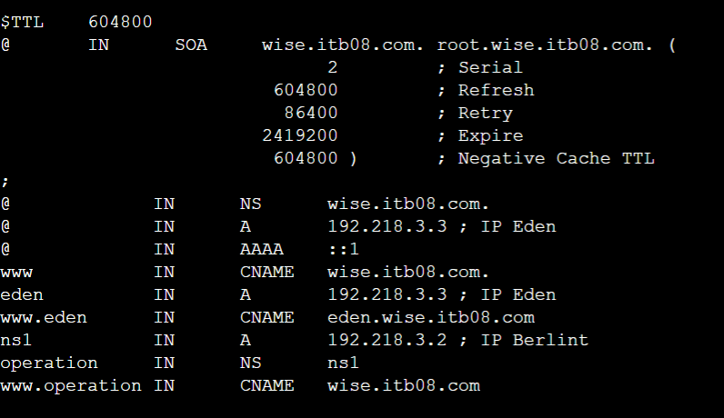
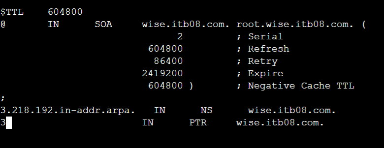
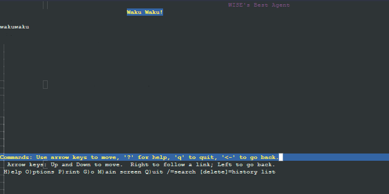

# Jarkom-Modul-2-ITB08-2022
## Anggota:
| Nama                      | NRP        |
|---------------------------|------------|
| Salsabila Briliana A. S.  | 5027201003 |
| Muhammad Rifqi Fernanda   | 5027201050 |
| Gilang Bayu Gumantara     | 5027201062 | 

## Soal 1 
---
WISE akan dijadikan sebagai DNS Master, Berlint akan dijadikan DNS Slave, dan Eden akan digunakan sebagai Web Server. Terdapat 2 Client yaitu SSS, dan Garden. Semua node terhubung pada router Ostania, sehingga dapat mengakses internet 
               gambar topologi

---
##### Konfigurasi Ostania
```
auto eth0
iface eth0 inet dhcp

auto eth1
iface eth1 inet static
	address 192.218.1.1
	netmask 255.255.255.0

 auto eth2
 iface eth2 inet static
	address 192.218.2.1
	netmask 255.255.255.0

auto eth3
iface eth3 inet static
	address 192.218.3.1
	netmask 255.255.255.0
```
##### Konfigurasi SSS
```

SSS
auto eth0
iface eth0 inet static
	address 192.218.1.2buat
	netmask 255.255.255.0
	gateway 192.218.1.1 
```
##### Konfigurasi Garden
```
auto eth0
iface eth0 inet static
	address 192.218.1.3
	netmask 255.255.255.0
	gateway 192.218.1.1
```
##### Konfigurasi Garden
```
auto eth0
iface eth0 inet static
	address 192.218.2.2
	netmask 255.255.255.0
	gateway 192.218.2.1
```
##### Konfigurasi Berlint
```
auto eth0
iface eth0 inet static
	address 192.218.3.2
	netmask 255.255.255.0
	gateway 192.218.3.1
```


##### Konfigurasi Eden
```
auto eth0
iface eth0 inet static
	address 192.218.3.3
	netmask 255.255.255.0
	gateway 192.218.3.1
```
Semua node terhubung pada router Ostania, sehingga dapat mengakses internet. pada node OSTANIA harus masukan command
  ``` 
 iptables -t nat -A POSTROUTING -j MASQUERADE -o eth0 -s 192.218.0.0/16
 ``` 
 terlebih dahulu

 setelah itu harus mengarah ke 192.168.211.1 
 dengan menggunakan command 
 ```
 echo "nameserver 192.168.122.1" > /etc/resolv.conf
 ```
## Soal 2
---
Untuk mempermudah mendapatkan informasi mengenai misi dari Handler, bantulah Loid membuat website utama dengan akses wise.yyy.com dengan alias www.wise.yyy.com pada folder wise
install bind9
```
apt-get install bind9 -y
```
awalnya konfigurasi pada file
di /etc/bind/named.conf.local

```
zone "wise.itb08.com" {
        type master;
        file "/etc/bind/wise/wise.ITB10.com";
};
```
lalu buat folder wise pada /etc/bind/  \
lalu buat file wise.itb08.com dan masukan konfigurasi
 ```
	
$TTL    604800
@       IN      SOA     wise.itb08.com. root.wise.ITB08.com. (
                        2022102602         ; Serial
                         604800         ; Refresh
                          86400         ; Retry
                        2419200         ; Expire
                         604800 )       ; Negative Cache TTL
;
@             IN      NS      wise.itb08.com.
@             IN      A       $WISE_IP ; IP WISE
@             IN      AAAA    ::1
www           IN      CNAME   wise.ITB08.com.
 ```
 setelah itu reset bind9 dengan command
 ```
 service bind9 restart
 ```

 selanjutnya tambahkan IP wise sebagai nameserver pada node SSS dan GARDEN  pada /etc/resolv.conf


## Soal 4
---
Buat juga reverse domain untuk domain utama

### Solution
---
Server WISE
Edit file `/etc/bind/named.conf.local` 

```
zone "wise.itb08.com"{
        type master;
        file "/etc/bind/wise/wise.itb08.com";
};

zone "2.218.192.in-addr.arpa" {
        type master;
        file "/etc/bind/wise/2.218.192.in-addr.arpa";
};
```

Kemudian konfigurasi pada file `/etc/bind/wise/2.218.192.in-addr.arpa`

```
$TTL    604800
@       IN      SOA     wise.itb08.com. root.wise.itb08.com. (
                              2         ; Serial
                         604800         ; Refresh
                          86400         ; Retry
                        2419200         ; Expire
                         604800 )       ; Negative Cache TTL
;
2.218.192.in-addr.arpa.   IN      NS      wise.itb08.com.
2                       IN      PTR     wise.itb08.com.
```
Setelah itu, restart service bind9 dengan `service bind9 restart`

### Testing
---
- host -t PTR 192.218.2.2


## Soal 5
---
Agar dapat tetap dihubungi jika server WISE bermasalah, buatlah juga Berlint sebagai DNS Slave untuk domain utama.

### Solution
---
**Server WISE**
Pertama, konfigurasi pada file `/etc/bind/named.conf.local` untuk melakukan konfigurasi DNS Slave yang mengarah ke Berlint

```
zone "wise.itb08.com"{
        type master;
 	notify yes;
        also-notify { 192.218.3.2; };
        allow-transfer { 192.218.3.2; };
        file "/etc/bind/wise/wise.itb08.com";
};

zone "2.218.192.in-addr.arpa" {
        type master;
        file "/etc/bind/wise/2.218.192.in-addr.arpa";
};
```
Setelah itu, restart service bind9 dengan `service bind9 restart` 

**Server Berlint**
Lakukan konfigurasi pada file `/etc/bind/named.conf.local` 

```
zone "wise.itb08.com" {
    type slave;
    masters { 192.218.2.2; }; // Masukan IP WISE tanpa tanda petik
    file "/var/lib/bind/wise.itb08.com";
};
```
Setelah itu, restart service bind9 dengan `service bind9 restart` 

### Testing
---
- Stop service bind9 pada server WISE


- Ping dengan server SSS


## Soal 6
Karena banyak informasi dari Handler, buatlah subdomain yang khusus untuk operation yaitu operation.wise.yyy.com dengan alias www.operation.wise.yyy.com yang didelegasikan dari WISE ke Berlint dengan IP menuju ke Eden dalam folder operation.

### Solution
---
**Server WISE**
Melakukan konfigurasi pada `/etc/bind/wise/wise.itb08.com`

```
$TTL    604800
@       IN      SOA     wise.itb08.com. root.wise.itb08.com. (
                              2         ; Serial
                         604800         ; Refresh
                          86400         ; Retry
                        2419200         ; Expire
                         604800 )       ; Negative Cache TTL
;
@             IN      NS      wise.itb08.com.
@             IN      A       192.218.2.2 ; IP WISE
@             IN      AAAA    ::1
www           IN      CNAME   wise.itb08.com.
eden          IN      A       192.218.3.3 ; IP Eden
www.eden      IN      CNAME   eden.wise.itb08.com.
ns1           IN      A       192.218.3.2 ; IP Berlint
operation     IN      NS      ns1
www.operation IN      CNAME   wise.itb08.com.
```

Kemudian melakukan konfigurasi option pada `/etc/bind/named.conf.options`

```
options {
        directory \"/var/cache/bind\";
        allow-query{any;};
        auth-nxdomain no;    # conform to RFC1035
        listen-on-v6 { any; };
};
```

Selanjutnya, edit konfigurasi pada `/etc/bind/named.conf.local`

```
zone "wise.itb08.com"{
        type master;
 	    //notify yes;
        //also-notify { 192.218.3.2; };
        allow-transfer { 192.218.3.2; };
        file "/etc/bind/wise/wise.itb08.com";
};

zone "2.218.192.in-addr.arpa" {
        type master;
        file "/etc/bind/wise/2.218.192.in-addr.arpa";
};
```

Lakukan restart bind9 dengan `service bind9 restart`

**Server Berlint**
Edit file `/etc/bind/named.conf.options` dan comment `dnssec-validation auto;` lalu tambahkan `allow-query{any;};` pada file `/etc/bind/named.conf.options`

Kemudian edit file `/etc/bind/named.conf.local` untuk delegasi `operation.wise.yyy.com`

```
zone "wise.itb08.com" {
    type slave;
    masters { 192.218.2.2; }; 
    file "/var/lib/bind/wise.itb08.com";
};

zone "operation.wise.itb08.com" {
	type master;
	file "/etc/bind/operation/operation.wise.itb08.com";
};
```

Buat direktori `mkdir /etc/bind/operation` dan konfigurasi pada file `/etc/bind/operation/operation.wise.itb08.com`

```
$TTL    604800
@       IN      SOA     operation.wise.itb08.com. root.operation.wise.itb08.com. (
                              2         ; Serial
                         604800         ; Refresh
                          86400         ; Retry
                        2419200         ; Expire
                         604800 )       ; Negative Cache TTL
;
@          IN      NS      operation.wise.itb08.com.
@          IN      A       192.218.3.3 ; IP Eden
www        IN      CNAME   operation.wise.itb08.com.
strix      IN      A       192.218.3.3 ; IP Eden
www.strix  IN      CNAME   strix.operation.wise.itb08.com.
```
Lalu restart service bind9 dengan `service bind9 restart`

### Testing
- ping operation.wise.itb08.com dan www.operation.wise.itb08.com


## Soal 7
Untuk informasi yang lebih spesifik mengenai Operation Strix, buatlah subdomain melalui Berlint dengan akses strix.operation.wise.yyy.com dengan alias www.strix.operation.wise.yyy.com yang mengarah ke Eden .
untuk nomer 7 akan dikonfigurasikan bind9 pada Berlint\
pada named.conf.local , tambahkan zone untuk operation.wise.itb08.com
```
zone "operation.wise.itb08.com" {
	type master;
	file "/etc/bind/operation/operation.wise.itb08.com";
};
```
tambahkan folder operation pada /etc/bind/ dan buat file operation.wise.itb08.com. pada folder tersebut\
pada file tersebut konfigurasikan seperti berikut
```
$TTL    604800
@       IN      SOA     operation.wise.itb08.com. root.operation.wise.itb08.com. (
                              2         ; Serial
                         604800         ; Refresh
                          86400         ; Retry
                        2419200         ; Expire
                         604800 )       ; Negative Cache TTL
;
@          IN      NS      operation.wise.itb08.com.
@          IN      A       192.218.2.3 ; IP Eden
www        IN      CNAME   operation.wise.itb08.com.
strix      IN      A       192.218.2.3 ; IP Eden
www.strix  IN      CNAME   strix.operation.wise.itb08.com.
```
setelah itu di restart bind nya 

## **testing**




## Soal 8 dan 9
(8)setelah melakukan konfigurasi server, maka dilakukan konfigurasi Webserver. Pertama dengan webserver www.wise.yyy.com. Pertama, Loid membutuhkan webserver dengan DocumentRoot pada /var/www/wise.yyy.com\
\
(9)Setelah itu, Loid juga membutuhkan agar url www.wise.yyy.com/index.php/home dapat menjadi menjadi www.wise.yyy.com/home 

install terlebih dahulu apache2 dan apt-get install libapache2-mod-php7.0 -y pada node eden\
dilanjutkan dengan tambahkan file wise.itb08.com.conf pada /etc/apache2/sites-available \
konfigurasikan seperti berikut
```
<VirtualHost *:80>
        # The ServerName directive sets the request scheme, hostname and port that
        # the server uses to identify itself. This is used when creating
        # redirection URLs. In the context of virtual hosts, the ServerName
        # specifies what hostname must appear in the request's Host: header to
        # match this virtual host. For the default virtual host (this file) this
        # value is not decisive as it is used as a last resort host regardless.
        # However, you must set it for any further virtual host explicitly.
        #ServerName www.example.com
        ServerAdmin webmaster@localhost
        DocumentRoot /var/www/wise.itb08.com
        ServerName wise.itb08.com
        ServerAlias www.wise.itb08.com
        
        <Directory /var/www/wise.itb08.com/>
                Options +Indexes
        </Directory>
 
        Alias \"/home\" \"/var/www/wise.itb08.com/index.php/home\"
        # Available loglevels: trace8, ..., trace1, debug, info, notice, warn,
        # error, crit, alert, emerg.
        # It is also possible to configure the loglevel for particular
        # modules, e.g.
        #LogLevel info ssl:warn
        ErrorLog ${APACHE_LOG_DIR}/error.log
        CustomLog ${APACHE_LOG_DIR}/access.log combined
        # For most configuration files from conf-available/, which are
        # enabled or disabled at a global level, it is possible to
        # include a line for only one particular virtual host. For example the
        # following line enables the CGI configuration for this host only
        # after it has been globally disabled with "a2disconf".
        #Include conf-available/serve-cgi-bin.conf
</VirtualHost>
```
untuk document rootnya sudah diarahkan ke /var/www/wise.yyy.com dan ditambahkan alias agar url www.wise.yyy.com/index.php/home dapat menjadi menjadi www.wise.yyy.com/home \

buat folder wise.itb08.com pada /var/www/
download terlebih dahulu isi dari wise.itb08.com setelah itu unzip ke folder tersebut
```
wget "https://drive.google.com/uc?id=1q9g6nM85bW5T9f5yoyXtDqonUKKCHOTV&export=download" -O eden.wise.zip
```

```
unzip eden.wise.zip
```

```
mv eden.wise/* /var/www/eden.wise.itb08.com
```
## **testing**
sebelumnya kita perlu mengganti IP wise.itb08.com pada node wise dan juga pada reverse domainnya




enable wise.itb08.com dengang command\
```
a2ensite wise.itb08.com
```
setelah itu reload dengan command
```
service apache2 reload
```
lalu restart apachenya

selanjutnya pada node eden juga harus diinstall lynx \
jika berhasil maka akan menampilkan seperti berikut



